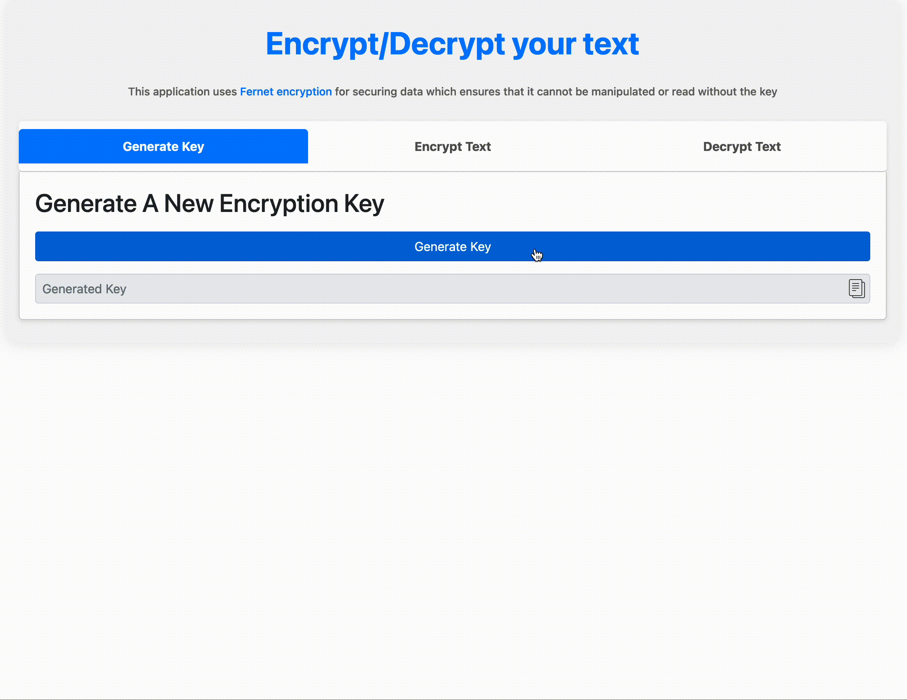

# EasyEncryption
[](https://github.com/itsluminous/EasyEncryption/actions/workflows/main.yml)
[](https://github.com/itsluminous/EasyEncryption/actions/workflows/github-code-scanning/codeql)
[](https://github.com/itsluminous/EasyEncryption/actions/workflows/release.yml)

Useful if you want to share some data with someone (eg. over mail) with strong encryption, and you don't trust the online companies doing encryption for you

Try out the tool at : https://easyencryption.onrender.com/  
**Note** that first launch might take a minute, subsequent runs will be instant.



# Features
- This application uses [Fernet encryption](https://cryptography.io/en/latest/fernet/) for securing data which ensures that it cannot be manipulated or read without the key.
- The tech stack is Python (with flask for web application)
- This repo has proper test coverage, CI/CD pipelines and docker packages published to container registry.

# Local Setup
### Using docker
- Ensure that you have [docker](https://docs.docker.com/get-docker/) installed and running.
- Run below command to start the app in docker
```
docker run -d --name easyencryption -p 5000:5000 ghcr.io/itsluminous/easyencryption:latest
```
- Now access the application at http://localhost:5000/

### Build docker image in local and run
- Ensure that you have [docker](https://docs.docker.com/get-docker/) installed and running.
- Clone this repo
```
git clone https://github.com/itsluminous/EasyEncryption.git
```
- Open your terminal/command prompt/powershell and cd to the `EasyEncryption` directory
- Run below command to build the docker image
```
docker build -t easyencryption .
```
- Run below command to start the app in docker
```
docker run -d --name easyencryption -p 5000:5000 easyencryption
```
- Now access the application at http://localhost:5000/

### Running directly in local, without docker
- Ensure that you have python 3 installed. Refer guide [here](https://realpython.com/installing-python/)
- Clone this repo
```
git clone https://github.com/itsluminous/EasyEncryption.git
```
- Open your terminal/command prompt/powershel and cd to the `EasyEncryption` directory
- Install the required dependencies using ``pip install -r requirements.txt``
- For UI, run ``python app.py`` and for CLI run ``python script.py``

# Run lint and test
### Lint
```
pylint $(git ls-files '*.py')  
```
### Test
```
python -m unittest discover -s tests
```

# Generate documentation for all files
```
pydoc -w $(git ls-files '*.py' | sed 's/\.py$//')  
```

# Sample Journey in CLI
```
$ python script.py

Choose an action:
1. Generate Key
2. Enter Key
3. Encrypt Message
4. Decrypt Message
5. Encrypt Text from File
6. Decrypt Text from File
7. Exit
Enter your choice (1-7): 1

Generated Key: WCoz5wXg2ex8sZtIkG9c3SR009leZoomnR21D263gig=

Choose an action:
1. Generate Key
2. Enter Key
3. Encrypt Message
4. Decrypt Message
5. Encrypt Text from File
6. Decrypt Text from File
7. Exit
Enter your choice (1-7): 3

Enter a message to encrypt (press Enter twice to finish):
Hi, How are you?
Here is my swiss bank account password : zH5^47$.w@b6CTp=[ED*


Encrypted message: b'gAAAAABlkXOfYBLSSV9Xa7GIuhOFSW4i-VlEAOfoJyfz9bLAT23eAQZVwlPE3EbaHTGH6VDptdGVKgYNUseABOniLZkt6pAaxWlFzi_tlqqMa9Q5vJChku6Me-8uL9S5Qv9ot_c7yznH4oYa2ZeLOYZ7djBMd5gCerthTb1tNNHb4QxUsE-TTHQ='

Choose an action:
1. Generate Key
2. Enter Key
3. Encrypt Message
4. Decrypt Message
5. Encrypt Text from File
6. Decrypt Text from File
7. Exit
Enter your choice (1-7): 4

Enter the encrypted message (press Enter twice to finish):
gAAAAABlkXOfYBLSSV9Xa7GIuhOFSW4i-VlEAOfoJyfz9bLAT23eAQZVwlPE3EbaHTGH6VDptdGVKgYNUseABOniLZkt6pAaxWlFzi_tlqqMa9Q5vJChku6Me-8uL9S5Qv9ot_c7yznH4oYa2ZeLOYZ7djBMd5gCerthTb1tNNHb4QxUsE-TTHQ=


Decrypted message: 
Hi, How are you?
Here is my swiss bank account password : zH5^47$.w@b6CTp=[ED*

Choose an action:
1. Generate Key
2. Enter Key
3. Encrypt Message
4. Decrypt Message
5. Encrypt Text from File
6. Decrypt Text from File
7. Exit
Enter your choice (1-7): 5

Enter the file path to encrypt:
data.txt

File 'data.txt' encrypted successfully.

Choose an action:
1. Generate Key
2. Enter Key
3. Encrypt Message
4. Decrypt Message
5. Encrypt Text from File
6. Decrypt Text from File
7. Exit
Enter your choice (1-7): 6

Enter the file path to decrypt:
data.txt.enc

File 'data.txt.enc' decrypted successfully.

Choose an action:
1. Generate Key
2. Enter Key
3. Encrypt Message
4. Decrypt Message
5. Encrypt Text from File
6. Decrypt Text from File
7. Exit
Enter your choice (1-7): 7

Exiting the program...    
```
