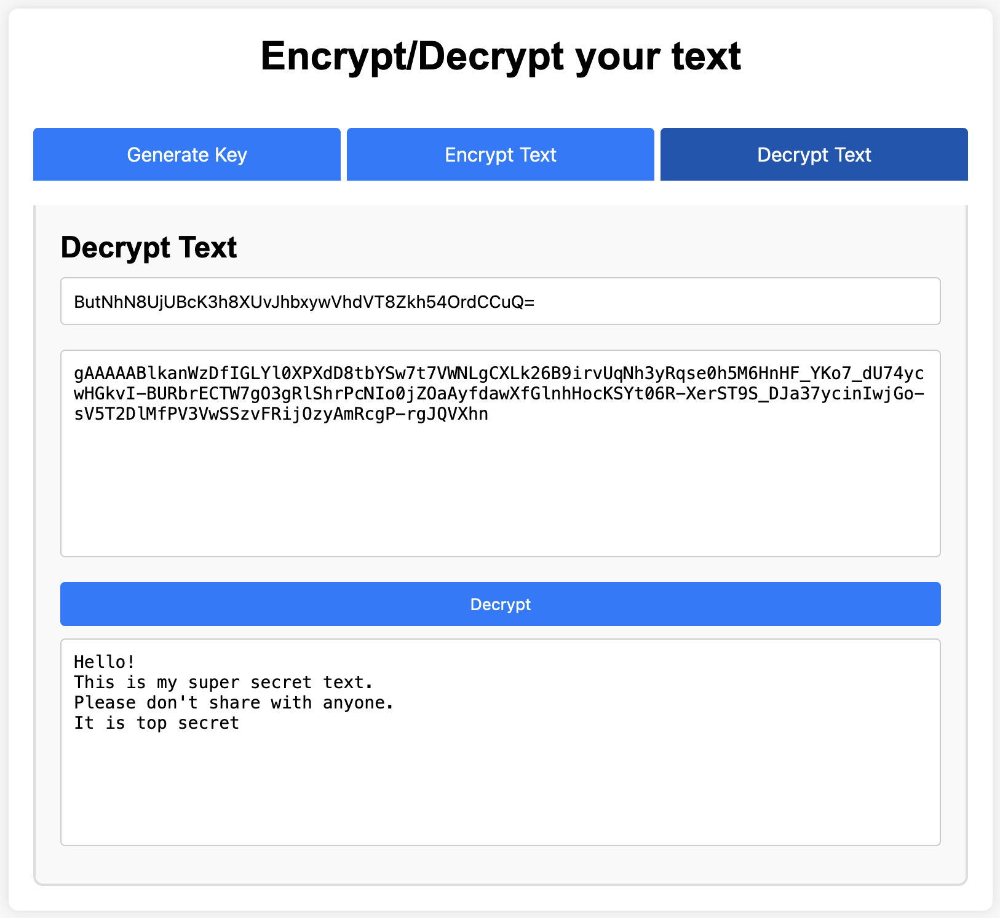

# EasyEncryption
Useful if you want to share some data with someone (eg. over mail) with strong encryption, and you don't trust the online companies doing encryption for you

# Setup
- Ensure that you have python 3 installed. Refer guide [here](https://realpython.com/installing-python/)
- Clone this repo
```
git clone https://github.com/itsluminous/EasyEncryption.git
```
- Open your terminal/command prompt/powersheel and cd to the `EasyEncryption` directory
- Install the required dependencies
```
pip install -r requirements.txt
```

# Usage
- Assuming you have python properly setup and dependencies installed, run following command and follow the prompt
```
python script.py
```
- If you instead want to use UI, then run this and then access app at http://localhost:5000/
```
python app.py
```

# Lint
```
pylint $(git ls-files '*.py')  
```

# Test
```
python -m unittest discover -s .

OR

python test_core.py
python test_script.py
```

# Generate documentation for all files
```
pydoc -w $(git ls-files '*.py' | sed 's/\.py$//')  
```

# UI screenshot


# Sample Journey
```
$ python script.py

Choose an action:
1. Generate Key
2. Enter Key
3. Encrypt Message
4. Decrypt Message
5. Encrypt Text from File
6. Decrypt Text from File
7. Exit
Enter your choice (1-7): 1

Generated Key: WCoz5wXg2ex8sZtIkG9c3SR009leZoomnR21D263gig=

Choose an action:
1. Generate Key
2. Enter Key
3. Encrypt Message
4. Decrypt Message
5. Encrypt Text from File
6. Decrypt Text from File
7. Exit
Enter your choice (1-7): 3

Enter a message to encrypt (press Enter twice to finish):
Hi, How are you?
Here is my swiss bank account password : zH5^47$.w@b6CTp=[ED*


Encrypted message: b'gAAAAABlkXOfYBLSSV9Xa7GIuhOFSW4i-VlEAOfoJyfz9bLAT23eAQZVwlPE3EbaHTGH6VDptdGVKgYNUseABOniLZkt6pAaxWlFzi_tlqqMa9Q5vJChku6Me-8uL9S5Qv9ot_c7yznH4oYa2ZeLOYZ7djBMd5gCerthTb1tNNHb4QxUsE-TTHQ='

Choose an action:
1. Generate Key
2. Enter Key
3. Encrypt Message
4. Decrypt Message
5. Encrypt Text from File
6. Decrypt Text from File
7. Exit
Enter your choice (1-7): 4

Enter the encrypted message (press Enter twice to finish):
gAAAAABlkXOfYBLSSV9Xa7GIuhOFSW4i-VlEAOfoJyfz9bLAT23eAQZVwlPE3EbaHTGH6VDptdGVKgYNUseABOniLZkt6pAaxWlFzi_tlqqMa9Q5vJChku6Me-8uL9S5Qv9ot_c7yznH4oYa2ZeLOYZ7djBMd5gCerthTb1tNNHb4QxUsE-TTHQ=


Decrypted message: 
Hi, How are you?
Here is my swiss bank account password : zH5^47$.w@b6CTp=[ED*

Choose an action:
1. Generate Key
2. Enter Key
3. Encrypt Message
4. Decrypt Message
5. Encrypt Text from File
6. Decrypt Text from File
7. Exit
Enter your choice (1-7): 5

Enter the file path to encrypt:
data.txt

File 'data.txt' encrypted successfully.

Choose an action:
1. Generate Key
2. Enter Key
3. Encrypt Message
4. Decrypt Message
5. Encrypt Text from File
6. Decrypt Text from File
7. Exit
Enter your choice (1-7): 6

Enter the file path to decrypt:
data.txt.enc

File 'data.txt.enc' decrypted successfully.

Choose an action:
1. Generate Key
2. Enter Key
3. Encrypt Message
4. Decrypt Message
5. Encrypt Text from File
6. Decrypt Text from File
7. Exit
Enter your choice (1-7): 7

Exiting the program...    
```